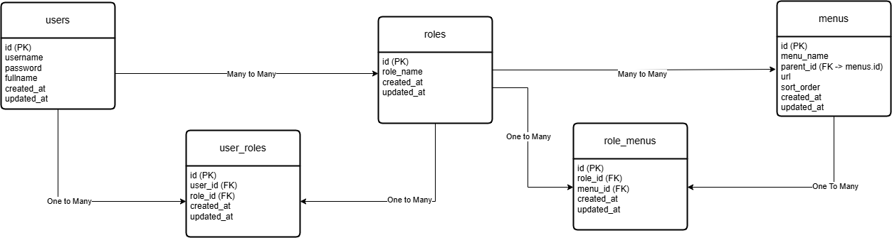

# Backend Test - PT Data Integrasi Inovasi

## ERD Diagram



## Project Description

This project is a backend system for employee access management.  
It includes authentication, role selection, and dynamic menu authorization based on user roles with multi-level (recursive) menu structure.

## Tech Stack

- Node.js
- Express.js
- PostgreSQL
- Sequelize ORM
- JWT (JSON Web Token)
- bcryptjs
- dotenv

## Project Structure

src/
├── config/ # Database configuration
├── controllers/ # Business logic
├── middleware/ # Auth middleware (JWT)
├── models/ # Sequelize models
├── routes/ # API routes
├── seeders/ # Initial data seeding
└── utils/ # Helper functions

## Features

### 1. Authentication

- Login using username & password
- Password encrypted using bcrypt
- JWT token generation

### 2. Role Management

- User can have multiple roles
- Role selection after login
- Role-based access control

### 3. Menu Management

- Dynamic menu based on role
- Multi-level (nested) menu structure
- Recursive parent-child relationship

## System Flow

Login → Select Role → Generate JWT → Access Menu by Role

## How to Run Project

### 1. Clone Repository

```bash
git clone <repo-url>
cd backend-test-dii

2. Install Dependencies
npm install

3. Setup Environment
Create .env file:
PORT=3000

DB_HOST=localhost
DB_PORT=5432
DB_NAME=backend_dii
DB_USER=postgres
DB_PASS=password

JWT_SECRET=backendtestsecret

4. Run Seeder
node src/seeders/seed.js

5. Run Server
npm run dev

API Documentation
Auth Endpoints

1. Login

URL : POST http://localhost:3000/auth/login

Request Body :
{
  "username": "ahmad",
  "password": "123456"
}

Response (Success - Multiple Roles) :
{
  "success": true,
  "message": "Choose Role",
  "user_id": 1,
  "roles": [
    {
      "id": 1,
      "role_name": "Admin"
    },
    {
      "id": 2,
      "role_name": "HR"
    }
  ]
}

Response (Error - User Not Found)
{
  "success": false,
  "message": "User not found"
}

{
  "success": false,
  "message": "Invalid password"
}

2. Select Role

URL : POST http://localhost:3000/auth/select-role

Request Body:
{
  "user_id": 1,
  "role_id": 1
}

Response (Success):
{
  "success": true,
  "message": "Role selected",
  "token": "jwt_token_here"
}


3. Menu

URL : GET http://localhost:3000/menus

Headers
Key 		Value
Authorization	Bearer <token>

Response (Success)
{
  "success": true,
  "data": [
    {
      "id": 1,
      "menu_name": "Menu 1",
      "url": "/menu-1",
      "sort_order": 1,
      "children": [
        {
          "id": 2,
          "menu_name": "Menu 1.1",
          "url": "/menu-1-1",
          "children": []
        }
      ]
    }
  ]
}

Response (Error - Invalid Token)
{
  "success": false,
  "message": "Invalid token"
}


🧠 Key Logic Explanation
1. Authentication Flow
    Login with username & password
    Validate user credentials
    Return available roles
2. Role Selection
    User selects role
    System generates JWT containing:
    user_id
    role_id
3. Menu Authorization
    Verify JWT
    Fetch menus based on role
    Build recursive menu tree

Example Menu Structure
Menu 1
 ├── Menu 1.1
 ├── Menu 1.2
      ├── Menu 1.2.1
      ├── Menu 1.2.2
Menu 2
 ├── Menu 2.1


Author
Ahmad Fauzi
```
